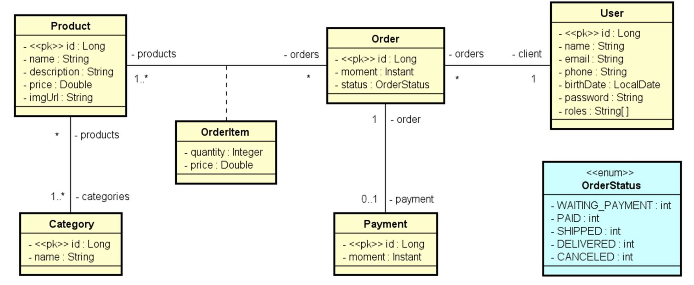

# Projeto DSCommerce

Este é um projeto desenvolvido em Java utilizando Spring Boot e o banco de dados H2. O DSCommerce é um sistema para ser utilizado em cursos da Devsuperior no processo de aprendizado dos alunos.

## Visão Geral do Sistema

O sistema DSCommerce é destinado a manter um cadastro de usuário, produtos e suas categorias. Permite aos usuários visualizar um catálogo de produtos, adicionar itens ao carrinho de compras, gerenciar o carrinho e registrar pedidos. Os pedidos podem ser pagos e atualizados para diferentes status.

## Modelo Conceitual

(Obs: Insira aqui a imagem do diagrama UML que representa o modelo conceitual do sistema.)

## Funcionalidades Implementadas

- CRUD de produtos, categorias e usuários
- Consultar catálogo de produtos
- Gerenciar carrinho de compras (adicionar, remover, alterar quantidades)
- Registrar e visualizar pedidos
- Pagamento de pedidos

## Protótipos de Tela

[Protótipos de tela no Figma](https://www.figma.com/file/ZrGNVNG0kZL6txDv4G8P6s/DSCommerce)

## Casos de Uso (Visão Geral)

O sistema consiste nos seguintes casos de uso:

- Manter produtos, categorias e usuários (somente admin)
- Consultar catálogo de produtos (público)
- Gerenciar carrinho de compras (público)
- Registrar pedido (usuário logado)
- Visualizar pedidos (usuário logado)
- Registrar pagamento (somente admin)
- Reportar pedidos (somente admin)

(Obs: Até o momento só foi criado o modelo de dominio e ORM)

